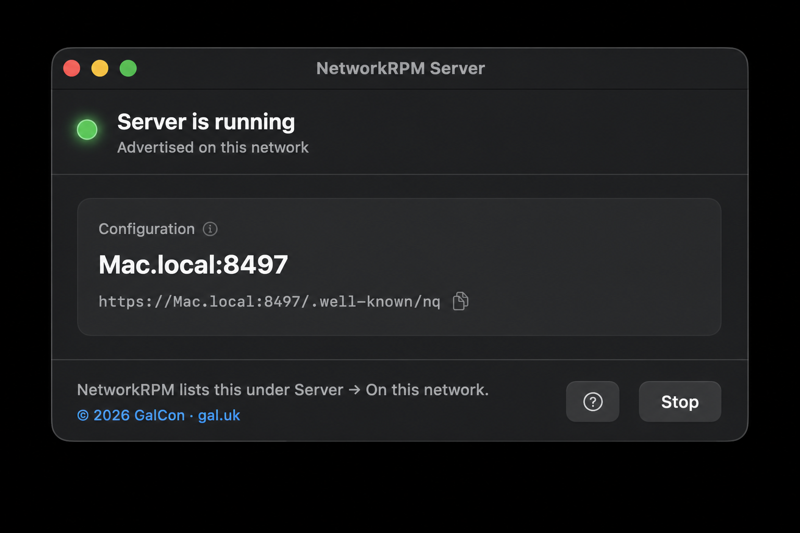
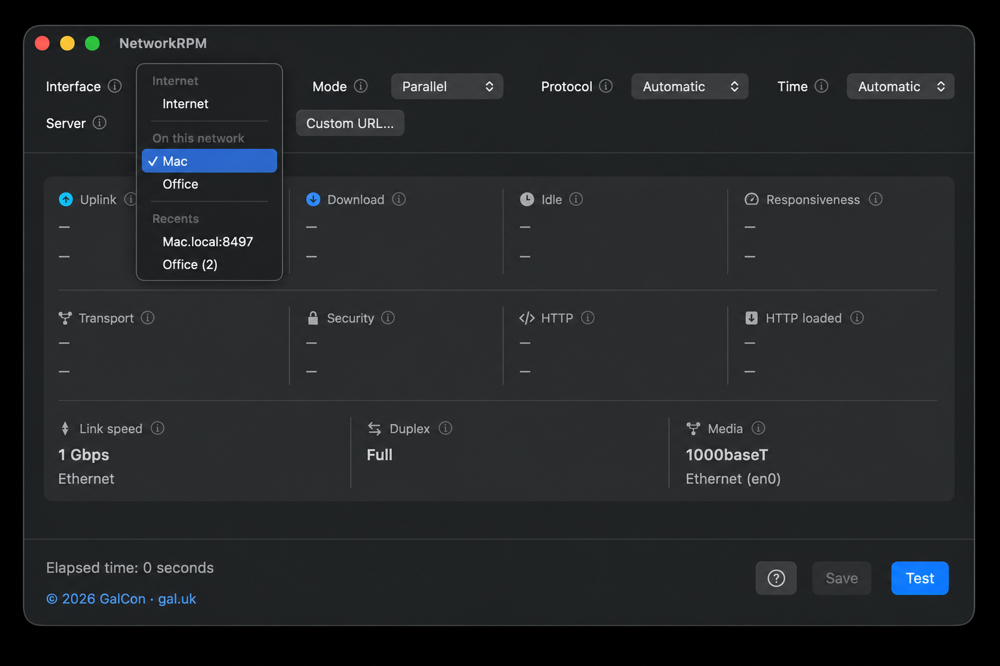

# NetworkRPM

A small macOS app from [GalCon](https://www.gal.uk). It tests how fast your network is and how it actually feels when the link is under pressure — on the **internet** (WAN, using Apple’s servers), or against another Mac on your **LAN or Wi-Fi** running **NetworkRPM Server**. The same measurement tells you whether the weak point is the WAN, the wireless hop, or the wired path in the building.


## Why responsiveness matters

Speed tells you how wide the pipe is. But a wide pipe can still make video calls stutter, games lag, or pages feel sticky — especially on a shared or loaded connection.

Responsiveness measures exactly that. It probes the network while the link is saturated, so the score reflects how things actually behave when it matters. Idle delay, by contrast, is the quiet-link round trip — useful context, but an optimistic reading.

The Responsiveness score is in RPM (round trips per minute). Higher is better. Lower milliseconds are better.

More background: [Apple Network Responsiveness](https://support.apple.com/en-us/HT212313) and the [Network Quality community wiki](https://github.com/network-quality/community/wiki).

## Install

macOS 14.6 or later. Universal (Apple silicon and Intel). NetworkRPM and NetworkRPM Server are separate installs.

**NetworkRPM (the tester)**

- **DMG:** [Download NetworkRPM](https://github.com/ofirgalcon/NetworkRPM/releases/latest/download/NetworkRPM.dmg)
- **PKG:** [Download the installer](https://github.com/ofirgalcon/NetworkRPM/releases/latest/download/NetworkRPM.pkg)

**NetworkRPM Server (the LAN target)**

- **DMG:** [Download NetworkRPM Server](https://github.com/ofirgalcon/NetworkRPM/releases/latest/download/NetworkRPM-Server.dmg)
- **PKG:** [Download the installer](https://github.com/ofirgalcon/NetworkRPM/releases/latest/download/NetworkRPM-Server.pkg)

Older builds: [Releases](https://github.com/ofirgalcon/NetworkRPM/releases).

Not on Homebrew yet — use the DMG.

If you still have the old **NetworkQuality** app, quit it and remove it after installing NetworkRPM.

## Using the app

1. Open **NetworkRPM**.
2. Pick your options in the controls at the top of the window, then click **Test**. Speed and RPM update while the test runs. **Stop** cancels a run in progress; figures collected so far stay on screen.
3. **Save** (⌘S) writes the last result to a text file, including the Ethernet or Wi-Fi snapshot taken when the test started.
4. Hover any **ⓘ** for a plain-English explanation of that control or result.
5. The **?** next to Save, or **Help → NetworkRPM Help**, opens this page.

| Option | What it does |
| --- | --- |
| **Interface** | Which connection to test. Automatic uses your Mac’s default. Only connections currently in use appear here. Bind to Wi-Fi or Ethernet when you want to compare those paths. |
| **Mode** | Parallel tests upload and download at the same time. Sequential does them one after the other. |
| **Protocol** | Automatic picks for you. Force HTTP/2 or HTTP/3 (QUIC) if you need to compare protocols. |
| **Time** | Cap how long the test runs, or leave it Automatic so it stops when it has enough samples. |
| **Server** | Apple’s internet servers, or a Network Quality server on this network — including **NetworkRPM Server**. **Custom URL…** only if it is not listed. Recents keeps the last 5. |

The test saturates the path you chose for as long as it runs. Avoid a metered connection, or one someone else is relying on.

## What you’re looking at

**Uplink** / **Download** — the Mbps the connection can carry in each direction. Think of it as pipe width.

**Accuracy** (Low / Medium / High) tells you how much to trust a reading, not how good the connection is. It sits next to speed, idle, and responsiveness, and means the same thing in each place — you can have Medium quality with High accuracy.

**Idle** — round-trip delay when the link is quiet. The large figure is RPM, with the milliseconds underneath. Higher RPM and lower ms are both good.

**Responsiveness** — how the network behaves when the path is loaded, scored Low / Medium / High / Very High. High or Very High means the experience held up under traffic.

**Transport / Security / HTTP / HTTP loaded** — delay at each stage while the link is busy. Transport is often blank when you’re running HTTP/3.

**Caption** — protocol and interface, then the LAN server name, or this connection’s WAN IP and ISP on an internet test. Save writes those details, plus local IP and the Apple test endpoint.

**Link tiles** — **Link speed / Duplex / Media** on Ethernet, or **Rate / SNR / RSSI / Channel** on Wi-Fi, captured the moment you clicked Test.

Colour is there to help you read a result at a glance:

- **Uplink is teal, Download is blue** — so you can tell the two directions apart without squinting.
- **Responsiveness** turns green for a good experience (High or Very High), orange for Medium, and red for Low.
- **Idle and the latency row** shade greener as RPM climbs.
- **Wi-Fi SNR** shades greener with a stronger signal.

## NetworkRPM Server

**NetworkRPM Server** is a small companion app. It runs macOS `networkQuality` as a local server so **NetworkRPM** on another Mac can test the network between them — office Wi-Fi, Ethernet, a VLAN — without sending that load to the internet.





### Set up the server

1. Install **NetworkRPM Server** on a second Mac on the same network. It is a separate download from NetworkRPM.
2. Open it. It picks a free port and starts automatically.
3. Wait until the LED is **green** (running). Yellow means starting; red means stopped.
4. Leave it open for as long as you want others to test against this Mac.

While the server runs, macOS is asked not to App-Nap or throttle it, so a test from another Mac is not slowed by this Mac going idle.

### Run a LAN or Wi-Fi test

1. On the Mac you want to measure, open **NetworkRPM**.
2. In the **Server** popup, choose the other Mac under **On this network**. NetworkRPM finds it by itself — you don’t need the URL.
3. Optionally set **Interface** to Wi-Fi or Ethernet if you want to force that path.
4. Click **Test**.

That run stresses the local path. Compare it with the **Server** popup → **Internet** on the same Mac to see whether the bottleneck is the LAN or the WAN.

### If the server does not appear

Bonjour can be blocked on some networks. That is uncommon. On the server Mac, copy the configuration URL with the small icon next to it, then on the test Mac choose **Custom URL…** and paste it. NetworkRPM already skips the self-signed certificate check for local servers.

### Stop the server

Click **Stop** to take it down without quitting. The LED turns red. **Start** brings it back on a new port. Quit also stops the server.

## Deploying

Each installer pkg drops its app into `/Applications`. No restart needed — quit the app first if it is already open.

| App | Receipt | Installs |
| --- | --- | --- |
| NetworkRPM | `com.gal.NetworkQuality` | `/Applications/NetworkRPM.app` |
| NetworkRPM Server | `com.gal.NetworkRPMServer` | `/Applications/NetworkRPM Server.app` |

**Munki / Jamf:** import the pkgs from [Releases](https://github.com/ofirgalcon/NetworkRPM/releases/latest). The pkg receipt and the app’s short version are the full version, matching the GitHub tag. Pin a version with the tagged URL (`.../releases/download/vX.Y.Z/NetworkRPM.pkg` or `.../releases/download/vX.Y.Z/NetworkRPM-Server.pkg`).

**Update checks:** both apps look on GitHub for a newer version about once a day, and **Check for Updates…** does the same when someone asks. They never replace the app. To turn that off, set `EnableUpdateChecks` to `false` in each app’s preference domain. Absent or `true` leaves checks on. A configuration profile custom settings payload with those domains works the same way.

```bash
sudo defaults write /Library/Preferences/com.gal.NetworkQuality EnableUpdateChecks -bool false
sudo defaults write /Library/Preferences/com.gal.NetworkRPMServer EnableUpdateChecks -bool false
```

## License

Copyright © 2024–2026 [GalCon](https://www.gal.uk).

Free to use and to pass on at no charge — personal or commercial — as long as you credit GalCon and include a link to [gal.uk](https://www.gal.uk). You may not sell the app.
