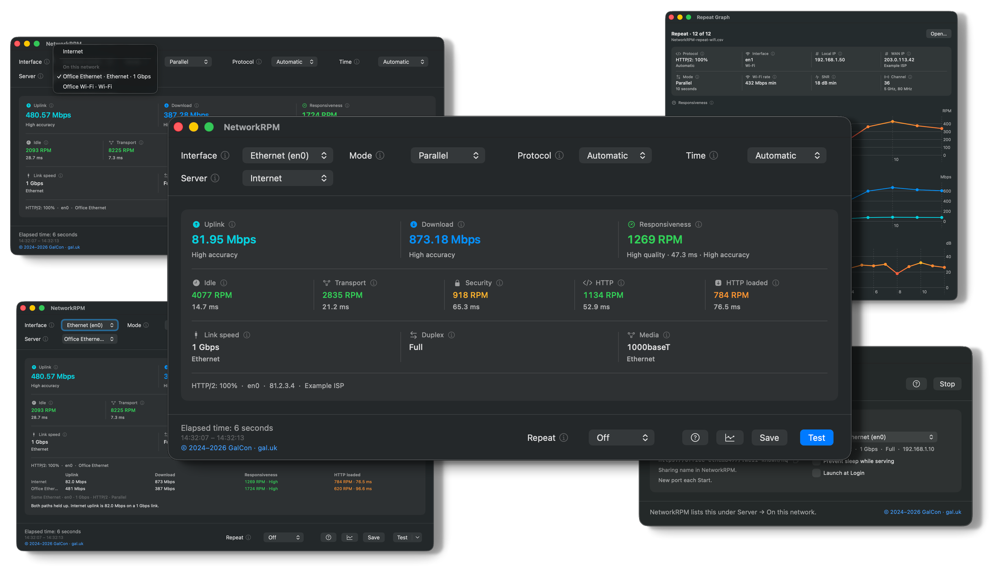
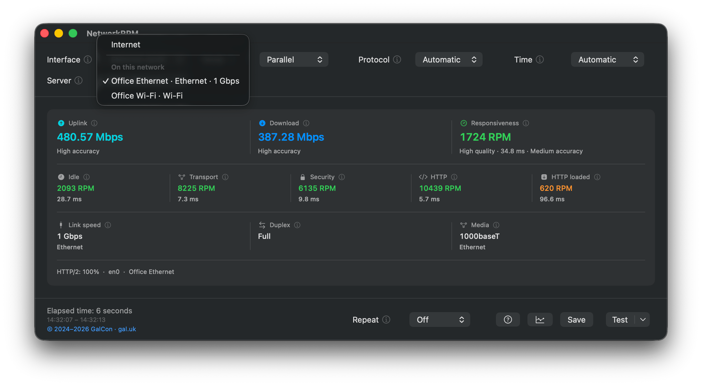

# NetworkRPM

A small macOS app from [GalCon](https://www.gal.uk). It measures how fast your network is and how it actually feels when the link is under pressure — whether on the **internet** (WAN, using Apple’s servers) or against another Mac on the **Local Network** running **NetworkRPM Server**. The same measurement helps identify whether the bottleneck is the WAN, the wireless hop, or the wired infrastructure in the building. **Repeat** can schedule tests on an interval and log each run, letting you monitor performance over time instead of relying on a single snapshot.

<p align="center">
  
</p>

## Why responsiveness matters

Speed tells you how wide the pipe is. But a wide pipe can still make video calls stutter, games lag, or pages feel sticky — especially on a shared or loaded connection.

Responsiveness measures how the connection holds up under load. It probes the network while the link is saturated, reflecting how things actually behave during heavy traffic. Idle delay, by contrast, is the quiet-link round trip — useful context, but an optimistic baseline.

The Responsiveness score is reported in RPM (round trips per minute); higher is better. Latency reflects round-trip delay in milliseconds; lower is better.

More background: [Apple Network Responsiveness](https://support.apple.com/en-us/HT212313) and the [Network Quality community wiki](https://github.com/network-quality/community/wiki).

## Install

macOS 14.6 or later. Universal (Apple silicon and Intel). NetworkRPM and NetworkRPM Server are separate installs.

**NetworkRPM (the tester)**

- **DMG:** [Download NetworkRPM](https://github.com/ofirgalcon/NetworkRPM/releases/latest/download/NetworkRPM.dmg)
- **PKG:** [Download the installer](https://github.com/ofirgalcon/NetworkRPM/releases/latest/download/NetworkRPM.pkg)

**NetworkRPM Server (Local Network)**

- **DMG:** [Download NetworkRPM Server](https://github.com/ofirgalcon/NetworkRPM/releases/latest/download/NetworkRPM-Server.dmg)
- **PKG:** [Download the installer](https://github.com/ofirgalcon/NetworkRPM/releases/latest/download/NetworkRPM-Server.pkg)

Older builds: [Releases](https://github.com/ofirgalcon/NetworkRPM/releases).

Not on Homebrew yet — use the DMG.

If you still have the old **NetworkQuality** app, quit it and remove it after installing NetworkRPM.

## Using the app

1. Open **NetworkRPM**.
2. Adjust options if needed (defaults work out of the box), then click **Test**. Speed and RPM update while the test runs. Click **Stop** to cancel the active run and any remaining repeats; numbers collected so far stay on screen.
3. **Repeat** (next to Test) schedules multiple runs. When Repeat is on, **Every** sets the idle wait interval between runs. The first **Test** with Repeat on prompts for a CSV destination; each finished run is automatically appended, so stopping early still leaves previously written rows intact.
4. **Save** (⌘S) writes the latest result as text — including Ethernet link metrics (speed, duplex, media) or Wi-Fi conditions (at start, lowest under load, and completion).
5. The **chart** button next to Help (or **File → Repeat Graph**) plots the Repeat CSV in real time, displaying RPM and Mbps along with Wi-Fi rate and SNR when recorded. Use **File → Open Repeat CSV…** (or **Open…** on the graph) to review an older file; **Open…** is disabled while Repeat is active.
6. Hover over the info icon next to any control or result for a plain-English explanation. The **?** button, or **Help → NetworkRPM Help**, opens this page.

<p align="center">
  
</p>

| Option | What it does |
| --- | --- |
| **Interface** | Which connection to test. Automatic is selected by default and follows the Mac’s primary route (displaying the interface name in parentheses). Only active network connections appear in this menu. Bind directly to Wi-Fi or Ethernet to compare those paths. A connected **VPN** is listed separately; those results measure the tunnel rather than the underlying physical link. |
| **Mode** | Parallel tests upload and download at the same time. Sequential tests them one after the other. |
| **Protocol** | Automatic chooses for you. Force HTTP/2 or HTTP/3 (QUIC) to compare protocols. HTTP/3 is omitted for servers on the Local Network, as local servers rarely support QUIC. |
| **Time** | How long **each** run may last. Set a cap, or leave Automatic so it finishes once it collects sufficient samples. Automatic displays total data transferred beside the progress bar. |
| **Server** | Choose Apple’s internet servers or a local Network Quality server — including **NetworkRPM Server**. Discovered servers appear under **Local Network** with their connection details (`Ethernet · 1 Gbps` or `Wi-Fi`). Use **Custom URL…** at the bottom (or **File → Custom Server URL…**) for manual endpoints. Recents remembers the last 5. |
| **Test** | Runs the test against the selected server. When targeting a server under **Local Network**, the Test button menu offers **Compare Internet and …** (Repeat must be Off). If that server is connected via Wi-Fi, slow Ethernet, or a VPN, Compare prompts for confirmation first because the server's link becomes the bottleneck. After a comparison, Save exports both runs. Remembered servers that are currently offline are listed under Recents with Test disabled until they return. |
| **Repeat** | Located next to Test; sets how many times to run. Off runs a single test. While Repeat is active — including the pause between runs — the Mac stays awake so system idle sleep does not throttle a test. The display can still sleep and the screen can lock. |
| **Every** | Appears next to Repeat when Repeat is on. Sets the idle wait after a run finishes before the next begins. Tests never overlap. |

The test saturates the selected path for its entire duration — and again on every repeat. Avoid running tests over metered connections or links that others depend on. Save exports the most recent finished run as text, even during the pause between repeats. The Repeat CSV is the log of the whole schedule.

<p align="center">
  
</p>

## What you’re looking at

**Uplink** / **Download** — the bandwidth in Mbps the connection can carry in each direction. Think of it as pipe width.

**Accuracy** (Low / Medium / High) indicates confidence in the measurement, not connection quality. It appears under both speed and responsiveness with the same meaning — a connection can have Medium quality with High accuracy.

**Responsiveness** — how the network performs when the link is saturated. The primary number is RPM (round trips per minute). The Low / Medium / High / Very High label underneath describes connection quality under load; High or Very High means it held up smoothly without lagging.

**Idle / Transport / Security / HTTP / HTTP loaded** — round-trip latency when the link is quiet (Idle), followed by each stage of connection setup and transfer under load. Higher RPM and lower milliseconds are both better. Transport is often blank when using HTTP/3.

**Caption** — displays the active protocol and interface, followed by the local server name or the public WAN IP on an internet test (provided by Cloudflare). An optional **Look up ISP** button queries Team Cymru via Cloudflare DNS for the network operator. Save writes these details alongside the local IP and Apple test endpoint.

**Link tiles** — For Ethernet, the tiles display **Link speed / Duplex / Media** captured when the test started. For Wi-Fi, **Wi-Fi rate / SNR / Signal / Channel** update continuously throughout the run. After a test, if radio conditions fluctuated, the primary figure displays the weakest reading (labelled **min**), with starting and ending values underneath. A channel change indicates that the Mac roamed to another access point.

Colour helps you interpret results at a glance:

- **Uplink is teal, Download is blue** — making the two directions easy to distinguish.
- **Responsiveness** colours the RPM figure: red below 300, orange from 300 to 1000, and green above 1000 (with smooth blends across boundaries). The Low / Medium / High / Very High text underneath reflects the test’s quality grade, while the colour strictly follows the numerical RPM.
- **The latency row** shades greener as RPM increases.
- **Wi-Fi SNR** shades greener with stronger signal quality. During and after a test, the colour follows the lowest SNR recorded.

## NetworkRPM Server

**NetworkRPM Server** is a small companion app. It runs macOS `networkQuality` as a local server so **NetworkRPM** on another Mac can test the network between them — office Wi-Fi, Ethernet, or a VLAN — without sending test traffic out to the internet.

<p align="center">
  
</p>

### Set up the server

1. Install **NetworkRPM Server** on a second Mac on the same network. It is a separate download from NetworkRPM.
2. Open it. The server selects an available port and starts automatically. The large name is this Mac’s Sharing name — which is how NetworkRPM lists it under **Local Network** (rather than by raw `hostname:port`). Interface, link speed, and local IP appear below the **Interface** popup. Copy the configuration URL only if Bonjour is blocked on your network; clicking **Start** chooses a new port, so older copied URLs will expire.
3. Wait until the status LED turns **green** (running). Yellow indicates starting; blue indicates a client is actively testing against this Mac; red indicates stopped.
4. Leave the window open while you want others to test against this Mac. Closing the window quits the app and stops the server. Enable **Launch at Login** to start it automatically upon login.

**Interface** binds the server to a specific network adapter — useful on dual-homed Macs to ensure clients test over the intended Ethernet link. Automatic follows the default route.

While running, **Prevent sleep while serving** (enabled by default) keeps the Mac awake so idle power management does not throttle tests from other Macs. The display can still sleep and the screen can lock. Uncheck this in the server window if you prefer to allow sleep.

### Test the Local Network

1. On the Mac you want to test from, open **NetworkRPM**.
2. In the **Server** popup, select the other Mac under **Local Network**. NetworkRPM discovers it automatically via Bonjour — no manual URL entry required.
3. Optionally set **Interface** to Wi-Fi or Ethernet if you want to test a specific adapter.
4. Click **Test** to measure the local connection between the two Macs.

### Compare Internet and Local Network (Multi-Test Mode)

To determine whether a bottleneck lies with the **internet** or the **Local Network**, select the remote server under **Local Network** and choose **Compare Internet and …** from the **Test** button menu (Repeat must be Off).

NetworkRPM runs two consecutive tests in a single automated session — first against Apple’s internet servers, and then immediately against the local server. When both runs complete, a side-by-side comparison strip appears below the connection details:

- **Uplink & Download** — compares bandwidth across both paths to reveal internet capacity versus local infrastructure limits.
- **Responsiveness & HTTP loaded** — compares RPM and loaded latency side-by-side to highlight where delays occur under traffic.
- **Automated verdict** — analyzes the results to explain which hop is the limiting factor (for example, *“The local path held up. The internet path did not”* or *“Both paths held up”*), accompanied by WAN uplink headroom notes on fast local connections.
- **Unified export** — clicking **Save** (⌘S) exports full metrics from both runs along with the comparison verdict in a single file.

<p align="center">
  
</p>

If the remote server is connected via Wi-Fi, slow Ethernet (< 1 Gbps), or a VPN, Compare prompts for confirmation before starting because the server's link can become the bottleneck.

For the most accurate diagnostics, connect the **server** Mac to gigabit (or faster) Ethernet, and place the **tester** Mac on the link you want to evaluate. Two Macs testing across Wi-Fi measure two wireless links sharing an access point rather than the building infrastructure. Likewise, a 100 Mbps adapter on the server caps the entire test at 100 Mbps. NetworkRPM flags Wi-Fi or slow Ethernet when reported by the server; otherwise Compare indicates that the remote link type could not be determined.

### Stop the server

Click **Stop** to take the server down without quitting the app (the LED turns red). Click **Start** to bring it back online on a new port. Closing the window or choosing Quit also stops the server.

### If the server does not appear

Bonjour discovery can occasionally be restricted on enterprise or segmented networks. If the server does not appear automatically, copy the configuration URL from the server Mac (using the copy icon next to it), then on the testing Mac choose **Custom URL…** from the **Server** popup and paste it. NetworkRPM automatically handles the self-signed TLS certificate required for local testing.

## Deploying

Each installer pkg installs its app into `/Applications`. No restart is required — quit any running copy before installing.

| App | Receipt | Installs |
| --- | --- | --- |
| NetworkRPM | `com.gal.NetworkQuality` | `/Applications/NetworkRPM.app` |
| NetworkRPM Server | `com.gal.NetworkRPMServer` | `/Applications/NetworkRPM Server.app` |

**Munki / Jamf:** Import the pkgs from [Releases](https://github.com/ofirgalcon/NetworkRPM/releases/latest). The pkg receipt and the app’s short version match the GitHub release tag. To pin a specific version, use the versioned download URL (`.../releases/download/vX.Y.Z/NetworkRPM.pkg` or `.../releases/download/vX.Y.Z/NetworkRPM-Server.pkg`).

**Update checks:** Both apps check GitHub for updates approximately once per day, and **Check for Updates…** performs an immediate check on demand. They notify of updates but never overwrite the running app. To disable automatic checks, set `EnableUpdateChecks` to `false` in each app’s preference domain (omitting the key or setting `true` leaves checks enabled). A configuration profile with a Custom Settings payload for these domains works identically.

```bash
sudo defaults write /Library/Preferences/com.gal.NetworkQuality EnableUpdateChecks -bool false
sudo defaults write /Library/Preferences/com.gal.NetworkRPMServer EnableUpdateChecks -bool false
```

## License

Copyright © 2024–2026 [GalCon](https://www.gal.uk).

Free to use and redistribute at no charge — for personal or commercial use — provided you credit GalCon and include a link to [gal.uk](https://www.gal.uk). You may not sell the app.
