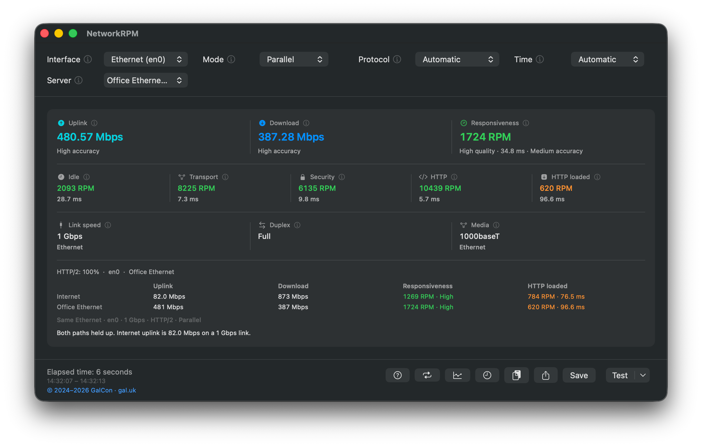
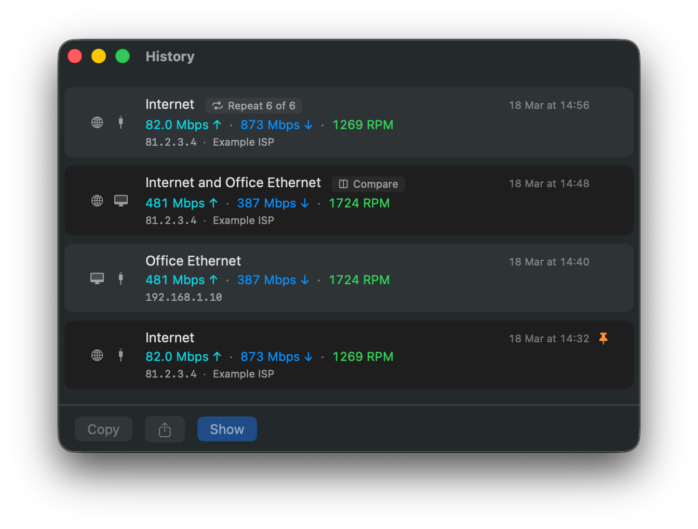
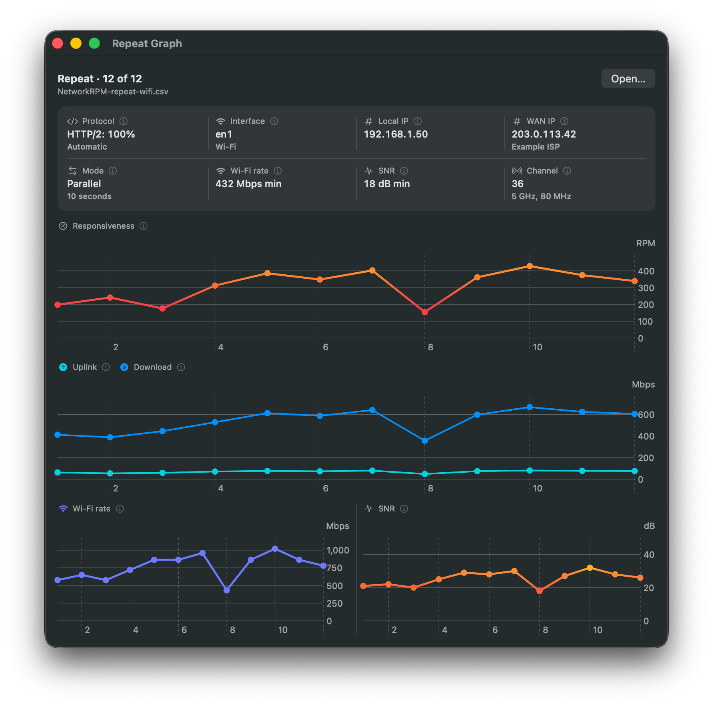

# NetworkRPM

A macOS GUI for Apple’s `networkQuality` test — **speed** and **responsiveness under load** (RPM), so you can spot bufferbloat and laggy links that a plain Mbps number misses.

**Who it’s for**

- Home Wi-Fi and video calls that feel sticky despite “fast” internet
- Offices that need to tell Local Network trouble from internet trouble
- Anyone who wants a clear GUI instead of the `networkQuality` command line

<p align="center">
  
</p>

<p align="center"><em>Compare — Internet vs Local Network, and which hop is the limit</em></p>

## Install

macOS 14.6 or later. Universal (Apple silicon and Intel). NetworkRPM and NetworkRPM Server are separate installs.

**NetworkRPM** (the tester)

- **DMG:** [Download NetworkRPM](https://github.com/ofirgalcon/NetworkRPM/releases/latest/download/NetworkRPM.dmg)
- **PKG:** [Download the installer](https://github.com/ofirgalcon/NetworkRPM/releases/latest/download/NetworkRPM.pkg)

**NetworkRPM Server** (Local Network)

- **DMG:** [Download NetworkRPM Server](https://github.com/ofirgalcon/NetworkRPM/releases/latest/download/NetworkRPM-Server.dmg)
- **PKG:** [Download the installer](https://github.com/ofirgalcon/NetworkRPM/releases/latest/download/NetworkRPM-Server.pkg)

**Homebrew**

```bash
brew install ofirgalcon/networkrpm/networkrpm
brew install ofirgalcon/networkrpm/networkrpm-server
```

Older builds: [Releases](https://github.com/ofirgalcon/NetworkRPM/releases).

If you still have the old **NetworkQuality** app, quit it and remove it after installing NetworkRPM.

## What it does

- Measures **uplink**, **download**, and **RPM** against Apple’s internet servers or a Mac on your Local Network
- **NetworkRPM Server** advertises over Bonjour so another Mac can test the local path without hitting the internet
- **Compare** runs internet then local back-to-back and shows which hop is the limit
- **Repeat** schedules tests on an interval; **Repeat Graph** charts RPM and Mbps over time
- **History** keeps recent sessions — pin the ones you care about
- Shows **Wi-Fi** or **Ethernet** link tiles while the test runs

<p align="center">
  
</p>

<p align="center"><em>NetworkRPM Server — leave it running on a wired Mac for Local Network tests</em></p>

<p align="center">
  
</p>

<p align="center"><em>History — recent runs, Compare sessions, and pinned results</em></p>

<p align="center">
  
</p>

<p align="center"><em>Repeat Graph — RPM, Mbps, and Wi-Fi rate across a scheduled series</em></p>

## Help

The full manual (same text as **Help → NetworkRPM Help**) is in [HELP.md](HELP.md).

## License

Copyright © 2024–2026 [GalCon](https://www.gal.uk/?networkrpm).

Free to use and redistribute at no charge — for personal or commercial use — provided you credit GalCon and include a link to [gal.uk](https://www.gal.uk). Not for resale. See [LICENSE](LICENSE).
