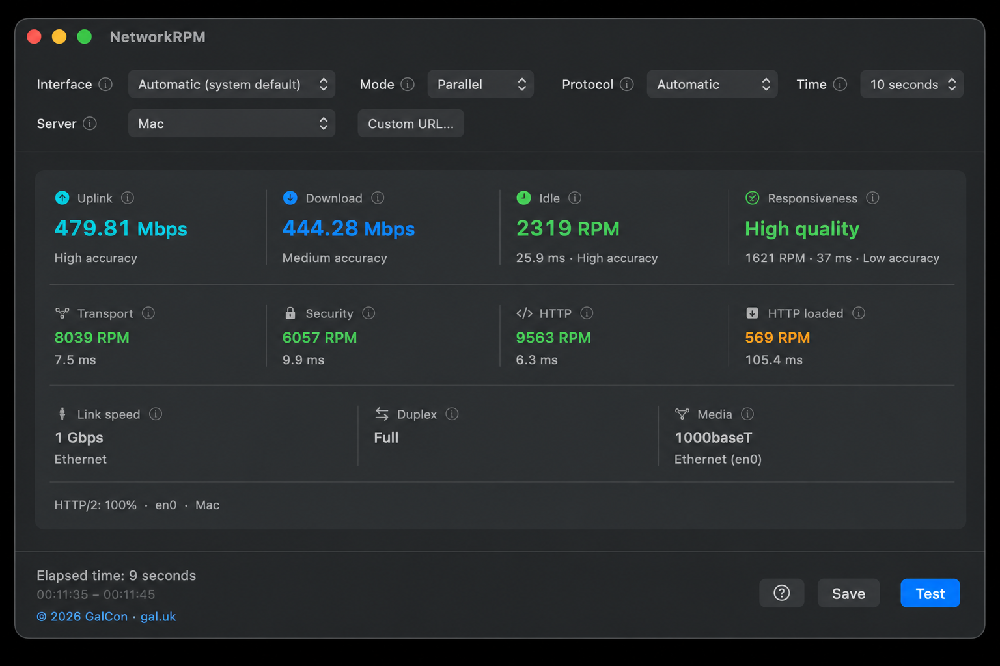

# NetworkRPM

A [GalCon](https://www.gal.uk/?networkrpm) Mac app that measures network speed and how the connection feels under load.

**[Download DMG](https://github.com/ofirgalcon/NetworkRPM/releases/latest/download/NetworkRPM.dmg)** · **[Download PKG](https://github.com/ofirgalcon/NetworkRPM/releases/latest/download/NetworkRPM.pkg)** · [All releases](https://github.com/ofirgalcon/NetworkRPM/releases)

macOS 14.6 or later. Universal (Apple silicon and Intel).

Free to use, with credit and a link to [gal.uk](https://www.gal.uk/?networkrpm).
